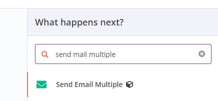
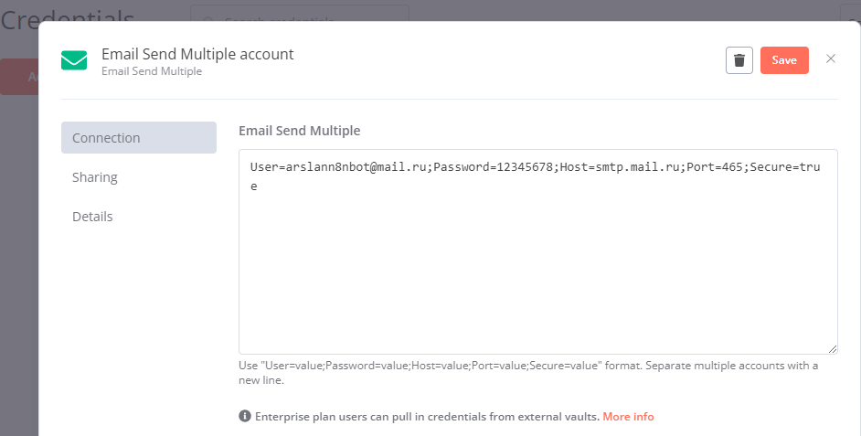
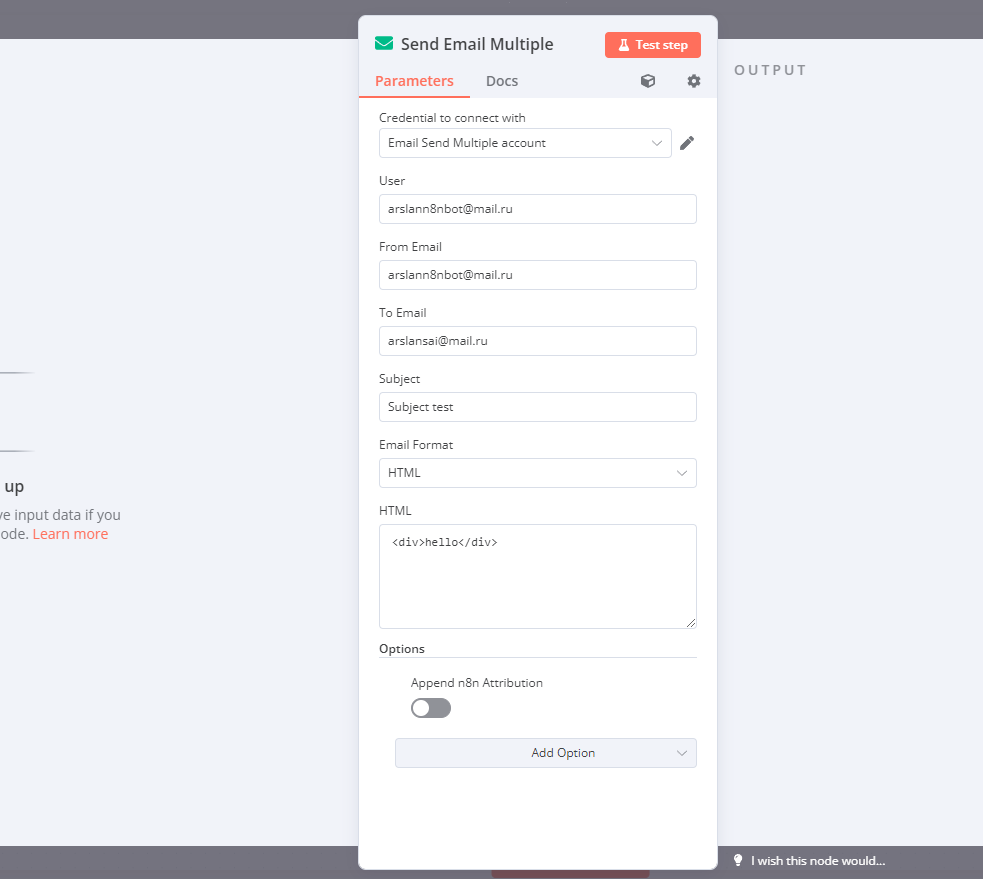

#  n8n-nodes-email-send-multiple

### Модуль Email Send Multiple для n8n

Я скопировал модуль Email Send из ядра n8n и доработал его. Новый пакет называется **n8n-nodes-email-send-multiple** и его нужно установить в настройках. В README файле содержится краткое описание, как работать с этим модулем.

#### Шаги для настройки и использования:

1. **Создание нового Email Send Multiple в credentials**
    - В разделе credentials создайте новый Email Send Multiple.

2. **Добавление аккаунтов**
    - Введите аккаунты в формате, где каждая строка представляет отдельный аккаунт. Пример:
      ```
      User=value11;Password=value12;Host=value13;Port=14;Secure=true
      User=value21;Password=value22;Host=value23;Port=24;Secure=false
      ```

3. **Добавление ноды Email Send Multiple в workflow**
    - Добавьте ноду Email Send Multiple в workflow. Она настраивается так же, как и стандартная Email Send нода, но есть одно отличие: присутствует поле **User**. По этому полю из выбранного credentials будет сопоставлена соответствующая строка с настройками.
    - Например, если указать **value11**, то будут использованы настройки из первой строки приведенного выше примера.

4. **Использование строк настроек напрямую**
    - Если в поле **User** указать строку настроек, как в credentials (например, `User=value21;Password=value22;Host=value23;Port=24;Secure=false`), то эти настройки применятся напрямую в этой ноде.
    - Это можно использовать, если настройки для подключения загружаются из другого блока, например из таблицы базы данных, и их можно указать здесь через шаблон.

Этот модуль позволяет гибко управлять несколькими учетными записями электронной почты и упрощает настройку отправки писем через различные SMTP-серверы в рамках одного workflow.

This is an n8n community node. It lets you create multiple mail send.

* [Installation](#installation)  
* [Usage](#usage)
* [Version history](CHANGELOG.md)

## Installation

Follow the [installation guide](https://docs.n8n.io/integrations/community-nodes/installation/) in the n8n community nodes documentation.

## Usage

This node uses N8N Credential to store the email account variables.

1. Add "`Send Email Multiple`" node to your workflow.
   
2. In the node configuration, either select an existing credential or create a new one.
3. Add the key-value pairs you want to use as Send Email Multiple.
   
4. Use the Send Email Multiple in your workflow
	 


"# n8n-nodes-email-send-multiple" 
